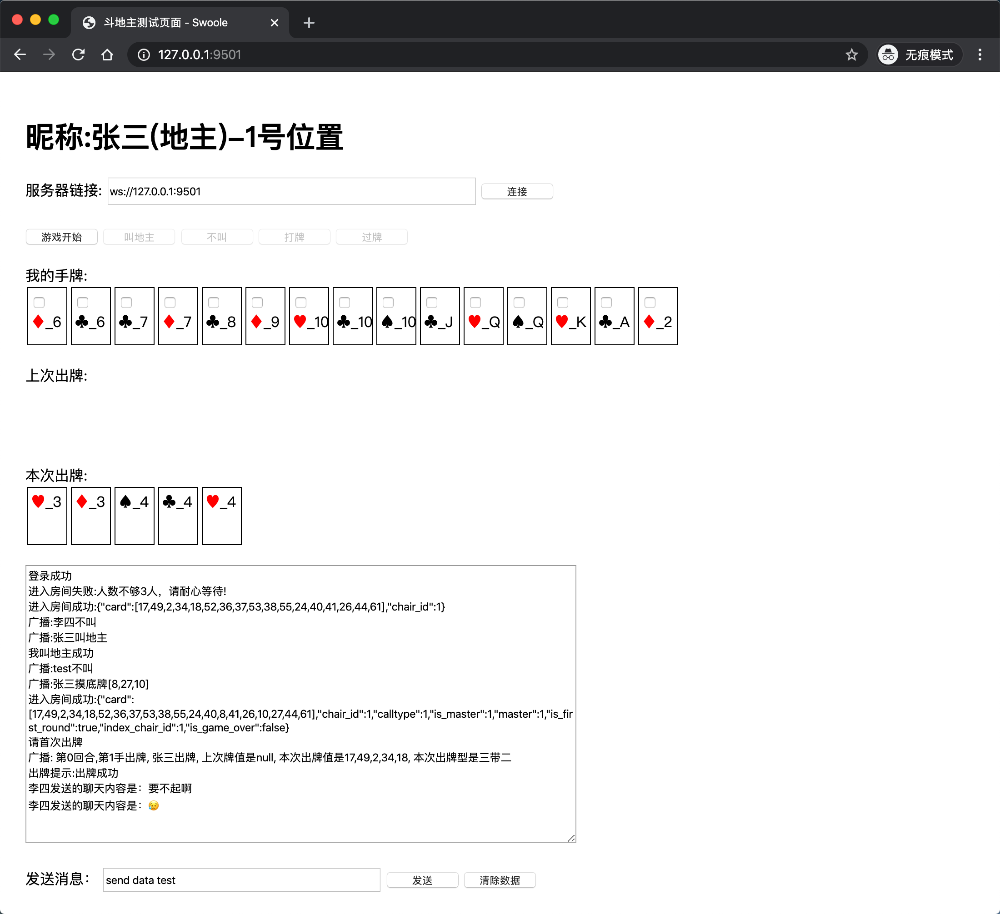

# 斗地主

♦️ 基于Hyperf框架开发斗地主游戏，实现斗地主游戏服务端逻辑，并采用原生js和WebSocket实现简单的客户端打牌逻辑，可以做到简单的玩斗地主游戏。

## 特性
* 实现前后端二进制封包解包，采用的是[msgpack](https://github.com/msgpack/msgpack-php)扩展，msgpack对数据进行了压缩，并实现粘包处理；
* 数据采用固定包头，包头4个字节存包体长度，包体前2个字节分别为`cmd`(主命令字)，`scmd`(子命令字)，后面为包体内容
* 采用策略模式解耦游戏中的每个协议逻辑
* 实现定义游戏开发`cmd`(主命令字)和`scmd`(子命令字)定义，cmd和scmd主要用来路由到游戏协议逻辑处理

## 依赖

* 运行 Hyperf 的环境
* [msgpack](https://github.com/msgpack/msgpack-php) 扩展

## 安装

```bash
git clone https://github.com/sy-records/game-ddz.git

cd game-ddz
composer install --no-dev
php bin/hyperf.php start
```

安装完成后访问 URL：[http://127.0.0.1:9501](http://127.0.0.1:9501)

## 使用示例

### 登陆

请随意输入英文或数字账号，这里是将用户账号当做`uid`使用，存入`redis`当中


### 打牌

根据按钮来操作打牌逻辑，消息框里会提示打牌逻辑过程



## 写在最后

此repo示例修改自[swoft-ddz](https://github.com/jxy918/swoft-ddz)，已和原作者联系。

如有定制开发需求可以联系QQ。<a target="_blank" href="http://wpa.qq.com/msgrd?v=3&uin=85464277&site=qq&menu=yes"></a>
